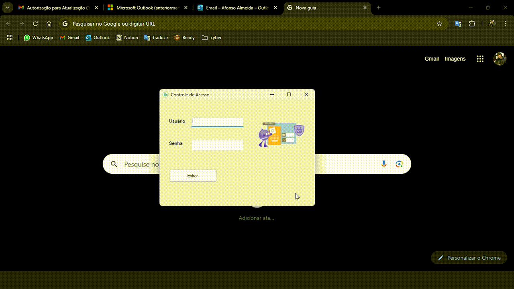

# Gerenciador Hospitalar - GH

Projeto Windows Forms desenvolvido para ambiente hospitalar com rotina de agendamento de consultas.

## Arquitetura de Nuvem Azure

## Como utilizar o app?

 - Clonando este repositório (terminal)
  > 🌟 **git clone https://github.com/afonsedev/Controle-Hospital.git**  
 - [Download do software (abra o setup e concorde com os termos do .NET, após a instalação, abra o arquivo do tipo application manifest na mesma pasta, ou pesquise na Aba Iniciar do Windows)](https://drive.google.com/drive/folders/1Q_ZbrUUaiHhqkPqyaKPh_l3c5NbYzAXO?usp=sharing)
 - [Base de dados dos pacientes, exames,  usuários e salas para testar o software:](https://docs.google.com/spreadsheets/d/1LNnkhQDvv5cafETPO4hO5ZzHu7yJCiW1X9N8TcZkUb4/edit?usp=sharing)

## Documentação

[Documentação do software](https://docs.google.com/document/d/1sPnjcye6g805wpANJ3SLGQxcJtGvD8yqkzFWcDtZIdY/edit?tab=t.0)

## Funcionalidades

- Adicionar agendamento
- Consultar agendamento
- Consultar agendamento
- Apagar agendamento
- Gerar QR Code com os dados do agendamento

## Stacks
- Linguagens:   
- Framework:  
- Cloud Provider: 
- Cloud Provider Services: SQL Server do Azure, Azure Key Vault
- Migração de banco de dados: Microsoft Data Migration Assistant
